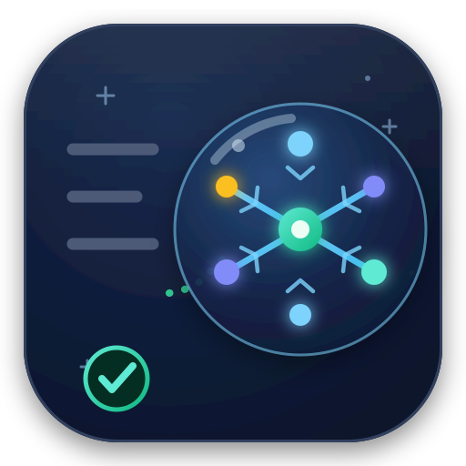
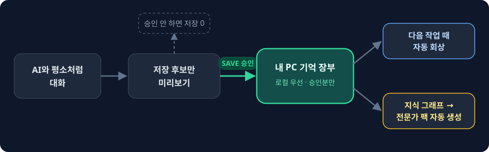
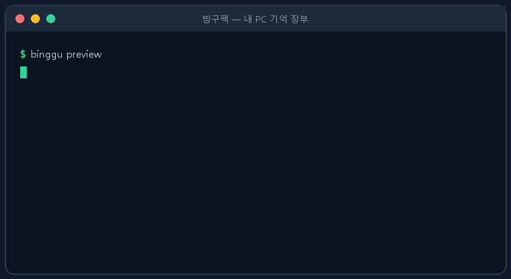
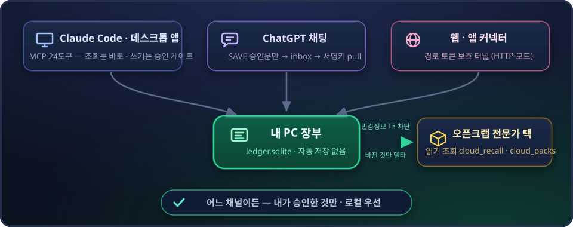

<div align="center">



# 🧠 BingguPack

**AI와 일하면서 쌓이는 내 판단·실수·취향·규칙을
내 PC 안의 기억 장부로 바꾸는 로컬 우선 AI 작업 메모리**

[](https://pypi.org/project/binggupack/)
[](https://pypi.org/project/binggupack/)
[](https://github.com/darkjokee-arch/binggupack/actions/workflows/ci.yml)
[](https://github.com/darkjokee-arch/binggupack/releases)
[](LICENSE)

**자동 저장 없음 · 내가 승인한 것만 · 로컬 우선**

[⚡ 빠른 시작](#-빠른-시작) · [✨ 기능 한눈에](#빙구팩이-해주는-일-한눈에) · [📖 처음 시작하기](docs/START_HERE.md) · [🛠 설치 가이드](INSTALL.md) · [🗂 문서 색인](docs/INDEX.md)

</div>

---

<p align="center"></p>

<p align="center"></p>

## ⚡ 빠른 시작

```bash
pip install binggupack
binggu start            # 내 PC에 기억 장부 만들기 — 끝
binggu onboard          # (선택) ChatGPT 저장 채널·자동 동기화까지 원클릭
```

자세한 설치·연결(Claude Code MCP, 웹/앱 커넥터)은 [설치 가이드](INSTALL.md)를 보세요.

## 빙구팩이 해주는 일 (한눈에)

**핵심 3단계 — 이것만 알면 됩니다.**

1. **골라서 보여주기** — 대화 중 "기억할 만한" 말만 추려서 보여줘요 *(아직 저장 안 함)*
2. **내가 승인** — 내가 고른 것만 내 PC에 저장돼요 *(자동 저장 절대 없음)*
3. **다시 꺼내주기** — 다음에 일할 때 관련 기억과 지난 실수를 먼저 보여줘요

**주요 기능 — 이름만 봐도 알 수 있게**

| 기능 | 무엇을 해주나 |
|---|---|
| 🧠 **기억 장부** | 내가 승인한 판단·교훈만 내 PC의 파일 하나에 차곡차곡 쌓여요 |
| 🔎 **자동 회상** | 새 작업을 시작하면 관련 기억과 지난 실수를 알아서 먼저 보여줘요 |
| 🗣️ **내 말 / AI 말 구분** | 누가 한 말인지 나눠서 저장해요 — 나중에 "누구 판단이었지?"가 안 헷갈려요 |
| 📊 **직감 점수** | 내 감이 맞았는지 AI가 맞았는지 공정하게 숫자로 세어줘요 |
| 🕸️ **지식 그래프** | 기억들을 근거로 연결해 지도처럼 묶어요 — 없는 관계는 지어내지 않아요 |
| 📦 **전문가 팩 자동 생성** | 그 지도가 오픈크랩(익스퍼트플랜)에 전문가 지식 팩으로 자동으로 올라가요 |
| 🌾 **지식 수확** | 주제만 말하면 웹·문서를 대신 뒤져 기억 후보를 모아와요 *(바로 저장은 안 함)* |
| 🧹 **기억 정리** | 틀려진 기억은 "이제 틀렸어" 한 마디로 교체·폐기돼요 |
| ⏰ **리마인더** | "나중에 다시 보자" 하면 때가 됐을 때 알려줘요 |
| 💬 **어디서나 사용** | Claude Code는 물론 ChatGPT 채팅·웹/앱 커넥터에서도 같은 기억을 써요 |
| 🚀 **원클릭 온보딩** | `binggu onboard` 한 번이면 내 클라우드 저장 채널·자동 동기화까지 셋업 끝 |
| 💾 **백업·복원** | 장부를 통째로 백업/내보내기하고, 실수했으면 언제든 되돌려요 |

**왜 믿을 만한가 — 안전장치 5종**

| 안전장치 | 뜻 |
|---|---|
| 🔒 **민감정보 차단** | 비밀번호나 이혼 같은 개인사는 애매하면 **무조건** 안 내보내요 |
| 🛡️ **변조 감지** | 누가 내 기억 장부를 몰래 고치거나 지우면 바로 들통나요 |
| ✋ **자동 저장 없음** | 아무리 자동화돼도 저장의 마지막 단계는 항상 **내 승인**이에요 |
| ✅ **거짓말 안 함** | 없는 근거를 지어내지 않아요 — 진짜 있는 것만 연결해요 |
| 🔁 **항상 일관** | 같은 상황이면 늘 똑같이 동작해요 *(들쭉날쭉 없음)* |

> 전부 **자동 저장 없이, 내가 승인한 것만, 로컬 우선**입니다.
> 명령어·용어까지 자세히는 아래 [기능 전체 지도](#기능-전체-지도)를 보세요.

> **v1.17.0 하이라이트** — MCP **24도구** · 웹/앱 커넥터(HTTP 모드) · ChatGPT 저장 채널 · 원클릭 온보딩 · backup/export/**restore** · CI 정적 게이트(ruff+tsc). 상세는 [CHANGELOG](CHANGELOG.md) · 구조는 [ARCHITECTURE](docs/BINGGUPACK_ARCHITECTURE.md).

[처음 시작하기](docs/START_HERE.md) · [10분 튜토리얼](docs/BINGGUPACK_TUTORIAL.md) · [설치](INSTALL.md) · [Claude Code MCP](INSTALL.md#install-claude-code-mcp-sandbox-entry) · [캡처 hook](docs/BINGGUPACK_CAPTURE_HOOK_SETUP.md) · [문서 색인](docs/INDEX.md)

AI와 오래 일하다 보면 이런 일이 반복됩니다.

- 매번 "나는 짧게 답하는 걸 좋아한다"고 다시 설명합니다.
- 예전에 터졌던 실수를 다른 작업에서 또 조심해야 합니다.
- AI가 맞았는지, 내 직감이 맞았는지 시간이 지나면 흐려집니다.
- 다른 기기에서 떠오른 메모를 나중에 내 작업 장부로 옮기고 싶습니다.
- 자동 저장은 편하지만, 내 대화와 민감정보가 마음대로 쌓이는 건 싫습니다.

BingguPack은 모든 대화를 긁어모으는 도구가 아닙니다.
다음에도 써먹을 **판단·교훈·선호·규칙**만 후보로 보여주고, 내가 직접 고른 것만 로컬 장부(`ledger.sqlite`)에 남깁니다.

## 이렇게 씁니다 *(명령어 몰라도 됩니다)*

```text
평소처럼 AI와 작업하다 "이건 기억해두자" 싶은 게 생김
  → 빙구팩이 저장 후보로 미리 보여줌
  → 내가 고른 것만 내 PC에 저장
  → 다음 작업 전에 관련 기억·지난 실수를 다시 보여줌
```

### 평소 사용 — 3단계면 끝

1. **설치** *(처음 한 번만)*
2. **자유롭게 사용** — 평소처럼 AI와 일해요. 빙구팩이 기억할 만한 걸 알아서 지켜봐요.
3. **"빙구팩 저장해"** — 이 한 마디면 오늘 나온 판단·교훈이 저장돼요. 끝.

   저장할 때 안에서 **5단계로 꼼꼼히** 처리해요:
   `1 분류 → 2 근거 → 3 지도(그래프) → 4 검증 → 5 내 승인`
   아무리 깊이 처리해도 **마지막은 항상 내 승인**이라, 자동 저장은 없어요.

### 내 온톨로지 팩 자동 업데이트 — 빙구팩의 목표

저장한 판단·교훈이 쌓이면, **"나를 이해하는 팩"**(내 사고방식·가치관 지도)으로 오픈크랩에 자동으로 올라가요. 빙구팩이 궁극적으로 지향하는 **"나만의 개인 AI"**가 이렇게 만들어져요.

- 세션마다 **바뀐 것만** 자동 반영해요 *(새로 저장한 것만 · 중복 없이 · 델타 방식)*
- 민감정보(개인사·비밀번호)는 여기서도 **무조건 빠져요** *(T3 하드 차단)*
- 쌓일수록 AI가 나를 더 잘 이해해요 — 내 판단 습관·선호·기준까지

**어떻게 수집되나요? (실제 동작)**

1. **무엇이 잡히나** — 대화 중 **판단·교훈·선호·규칙·위험 감지** 같은 "생각의 단위"만 후보로 골라요. 단순 조회·일회성 지시·잡담은 안 잡습니다. *(정규식 게이트가 판정하고, AI는 보조 역할만 — 게이트를 못 뒤집어요.)*
2. **5종으로 분류** — 골라낸 문장을 **문서 · 증거 · 개념 · 상태 · 판단** 다섯 종류로 나눠요. *(패턴이 명확할 때만 그 종류, 애매하면 "판단"으로 — 오분류보다 안전.)*
3. **근거로 연결** — 문장들을 *"이게 저 판단의 근거"* 식으로 잇되, **연결마다 근거(evidence)가 반드시 있어야** 해요. 근거 없는 연결은 아예 안 만들어요. *(= 없는 관계를 지어내지 않음, 환각 0.)*
4. **내 말 / AI 말 구분** — 누가 한 말인지 화자(나 / AI)를 나눠서 기록해요.
5. **승인 → 로컬 저장** — *"빙구팩 저장해"*로 **내가 승인한 것만** 내 PC 장부(`ledger.sqlite`)에 저장돼요. (여기까진 전부 내 PC 안.)
6. **팩으로 자동 업로드** — 내 장부의 판단들을 모아 → **민감정보를 걸러내고(T3)** → **지난번과 비교해 바뀐 것만(델타)** → **AI가 오픈크랩 온톨로지 팩에 올려요.** 올린 뒤 "여기까지 올렸다" 기준점을 갱신해 **다음엔 또 새로 바뀐 것만** 올립니다. *(자동 프로그램이 몰래 올리는 게 아니라, 안전을 위해 AI가 확인하며 올려요.)*

> 그래서 나는 따로 할 게 없어요. 평소처럼 쓰고 **"저장해"** 한 마디면 끝.

### 수확 — 자료 모아 팩 만들기

1. **주제 말하기** — 예: *"바다낚시 정보 수집해서 오픈크랩에 팩으로 올려줘"*
2. **깊이(탐색) 정하기** — 주제를 몇 단계까지 파고들지 정해요 *(기본 4단계)*
   - **1단계**: 큰 갈래만 *(바다낚시 → 장비 · 장소 · 시기 · 어종)*
   - **2단계**: 갈래별 세부까지 *(장비 → 낚싯대 · 릴 · 미끼)*
   - **3단계**: 더 깊은 세부까지 *(낚싯대 → 원투대 · 루어대 · 찌낚싯대)*
   - **4단계**: 가장 촘촘하게 *(기본값 · 원투대 → 길이 · 강도 · 가격대)*
   - 원하면 5단계 이상도 되지만 그만큼 **분량이 많아져요** *(전체 수집량으로 폭주는 막아요)*.
3. **자동 업로드** — 완성된 팩이 오픈크랩(익스퍼트플랜)에 자동으로 올라가요.

### 그 밖에 — 말만 하면 돼요

- 🔄 **다시 꺼내기** — 새 작업을 시작하면 관련 기억·지난 실수를 알아서 먼저 보여줘요
- 🗣️ **내 말 / AI 말 구분** — 저장할 때 누가 한 말인지 자동으로 나눠줘요
- 📊 **직감 점수** — *"내 직감 얼마나 맞았어?"* 하면 숫자로 알려줘요
- 🧹 **기억 고치기** — *"이 기억 이제 틀렸어, 바꿔줘"* / *"이건 폐기해"* 하면 돼요
- ⏰ **알림** — *"이건 나중에 다시 보자"* 하면 다시 볼 때 알려줘요

### 웹·앱·ChatGPT에서도 씁니다

<p align="center"></p>

- 🌐 **웹/앱 커넥터(HTTP 모드)** — 로컬 MCP 서버를 HTTP 모드(`--http`)로 열고 Cloudflare Tunnel 뒤에 두면, Claude 웹/앱 커넥터에서도 같은 **24도구**를 그대로 씁니다. 접근은 경로 토큰(`BINGGU_MCP_PATH_TOKEN`)으로 보호돼요.
- 💬 **ChatGPT 저장 채널** — ChatGPT 채팅 중 `SAVE n`으로 승인한 것만 클라우드 inbox에 잠깐 담기고, 내 PC가 서명키로 가져와(pull) 로컬 장부에 반영해요. 여기서도 자동 저장은 없어요.
- ☁️ **클라우드 읽기 도구** — `cloud_recall`/`cloud_packs`로 오픈크랩의 지식·팩을 조회만 해요(읽기 전용 · 민감정보 마스킹 · 미설정 시 조용히 통과).

## 기능 전체 지도

> 위 "빙구팩이 해주는 일"을 명령어·용어와 함께 정리한 개발자용 목록입니다.

**명령어별 한 줄 설명**

- **미리보기·저장(preview → SAVE)**: 기억할 만한 판단·교훈만 후보로 보여주고, 내가 고른 것만 로컬 장부에 저장합니다.
- **회상(recall/ask)**: 작업을 시작하기 전에 관련 기억과 과거 실수 패턴을 다시 꺼내줍니다.
- **근거 추적(trace)**: 그 회상이 실제로 도움이 됐는지를 기록해 회상 품질을 다듬습니다.
- **화자 분리(pair)**: 내 말과 AI 말을 나눠 저장하고, 내 직감이 맞았는지 적중률을 셉니다.
- **기억 정리(deprecate/replace)**: 오래된 판단을 교체·폐기하고, 다시 볼 것에 리마인더를 겁니다.
- **수확(harvest)**: 외부 웹·문서에서 저장 후보가 될 소스를 긁어옵니다(바로 저장 아님·후보만).
- **깊이 탐색(explore `--depth`)**: 주제 하나에서 하위 개념을 재귀(BFS)로 `--depth`만큼 파고들어, 관련 소스·기억 후보를 넓게 찾아냅니다(폭 `--breadth`·관련도 `--rel-min`도 조절).
- **그래프·팩(graph/pack)**: 기억을 근거로 연결해 그래프를 만들고, 팩 형식으로 묶어 내보냅니다. 근거는 2층(추천)·3층(그래프)·5층(사람 승인)으로 깊이를 더할 수 있습니다.
- **클라우드 팩(오픈크랩/익스퍼트플랜)**: 묶은 그래프·팩을 오픈크랩(ExpertPlan)에 전문가 지식 팩으로 자동 생성합니다.
- **Claude Code 연결(hook·MCP)**: 캡처/회상 hook과 MCP 24도구(stdio + HTTP 모드)로 Claude Code·웹/앱 커넥터에 붙습니다.
- **폰·웹·ChatGPT 동기화(hosted)**: 다른 기기·ChatGPT 채팅에서 승인해 잠깐 받아둔 메모를 로컬 장부로 가져옵니다.
- **안전장치(governance/selftest)**: PII·secret 차단, 사람 승인 경계, 자체 검증으로 안전을 강제합니다.

전체 기능을 길게 펼치면 오히려 안 읽히기 때문에, 아래처럼 한 장으로 압축했습니다.
세부 명령과 설치 절차는 [설치 가이드](INSTALL.md)와 [문서 색인](docs/INDEX.md)에 모아두었습니다.

| 영역 | 들어 있는 기능 |
|---|---|
| **로컬 기억 장부** | `init/start`, `doctor/status`, `list`, 로컬 `ledger.sqlite`, snapshot/audit log |
| **후보 선별·저장** | `preview/remember`, `reflect`, `save`, 사람 `SAVE n` 승인, PII/secret 차단 |
| **작업 전 회상** | `ask/recall/why`, `preflight`, `trace`, 회상 근거·효용 기록 |
| **기억 정리** | `deprecate`, `replace`, `accept/unaccept`, `due`, `reminders`, `resolve`, `route` |
| **내 말 vs AI 말** | `pair`, `trust`, owner/ai 화자 분리, 수용·반박·수정 관계, 직감 적중률 |
| **Claude Code·커넥터 연결** | `capture` hook, `preflight` hook, save-gate hook, stdio MCP 서버, HTTP 모드(`--http`·터널 뒤 웹/앱 커넥터), MCP 24도구(read 16 · dry-run 2 · confirm 게이트 쓰기 6) |
| **폰·웹·클라우드 보조** | `hosted inbox/pull`, `setup-cloud`, Cloudflare Worker save-intent, ChatGPT 저장 채널(inbox→서명키 pull), `cloud_recall`/`cloud_packs`(read), TTL/HMAC/purge 경계 |
| **외부 소스·그래프·팩** | `harvest`, `confirm-edges`, graph schema, pack contract, local ingest, watcher 계열 |
| **안전·개발자 도구** | path safety, match policy, classifier, interactive save, session close, governance, selftest, publish/export, reviewed plan, hybrid AGI 실험 모듈 |

```text
CLI 전체: init/start · status/doctor · preview/remember · reflect · save · list
          recall/ask/why · trace · preflight · deprecate/replace/accept/unaccept
          due/reminders/resolve · pair/trust/route · capture · hosted · harvest
          confirm-edges · setup-cloud
```

## 핵심 원칙

- **내 PC가 정본입니다.** 기본 장부는 로컬 `ledger.sqlite`입니다.
- **자동 영구 저장은 없습니다.** AI, hook, hosted 경로는 후보를 만들 수 있을 뿐입니다.
- **민감정보는 후보 단계에서 차단합니다.** 비밀번호·개인정보를 기억으로 쌓지 않는 쪽이 기본값입니다.
- **클라우드는 보조 경로입니다.** hosted inbox는 잠깐 받아두는 통로이고, 원본 기억을 맡기는 서비스가 아닙니다.
- **기억도 고칠 수 있습니다.** 오래된 판단은 교체, 폐기, 재검토할 수 있습니다.

### 처음이라면 여기부터

**[docs/START_HERE.md](docs/START_HERE.md)** 에서 5분 흐름만 따라가면 됩니다.

## 빙구팩이 아닌 것

범위를 일부러 좁게 잡았습니다.

- 문서 검색용 RAG가 아닙니다.
- 팀 위키가 아닙니다.
- 모든 대화를 자동으로 수집하는 도구가 아닙니다.
- 클라우드에 원본 기억을 맡기는 서비스가 아닙니다.

핵심은 **내 판단을 내가 승인해서 남기고, 다음 작업 전에 꺼내 쓰는 것**입니다.

## 직접 명령어로 쓰기 *(개발자용)*

clone해서 바로 쓸 수 있습니다. 아래에서 `binggu`라고 부르는 명령은 clone한 폴더에서는 `python binggu.py`로 실행하면 됩니다.

일반 사용자는 PyPI 설치가 가장 짧습니다. (PyPI 반영이 늦으면 아래 `git clone`으로 최신 v1.17.0을 사용하세요.)

```bash
pip install binggupack
binggu start
binggu remember "배포 전에 live endpoint를 먼저 확인한다"
binggu doctor
```

`python -m binggupack doctor`처럼 모듈 실행도 됩니다.

소스에서 바로 실행하려면 clone해서 `python binggu.py`를 쓰면 됩니다.

```bash
git clone https://github.com/darkjokee-arch/binggupack.git
cd binggupack
python binggu.py start
```

내가 기억하고 싶은 말을 미리 봅니다. 이 단계에서는 저장되지 않습니다.

```bash
python binggu.py remember "배포 전에 live endpoint를 먼저 확인한다"
```

출력에 저장 명령이 같이 나옵니다. 그 명령을 보고 내가 고른 번호만 저장합니다.

처음 보는 문서가 많다면 [START_HERE](docs/START_HERE.md) → [10분 튜토리얼](docs/BINGGUPACK_TUTORIAL.md) → [설치 가이드](INSTALL.md)까지만 보면 됩니다.

```bash
python binggu.py save "배포 전에 live endpoint를 먼저 확인한다" \
  --preview-id <화면에 나온 id> --pick 1 --explicit --confirm "SAVE 1"
```

다음 작업 전에 관련 기억을 불러옵니다.

```bash
python binggu.py ask "배포 전에 조심할 것?"
```

상태 점검은 이렇게 합니다.

```bash
python binggu.py doctor
```

## 무엇이 저장 후보가 되나요

자동 캡처와 미리보기는 같은 기준을 씁니다.
아무 문장이나 저장 후보로 올리지 않습니다.

| 후보가 됨 | 후보가 안 됨 |
|---|---|
| 판단: "이건 B안으로 간다" | 조회: "상태 보여줘" |
| 교훈: "다음부터 백업 먼저" | 일회성 지시: "지금 이거 고쳐" |
| 선호: "나는 짧은 답을 선호한다" | 운영 보고: "커밋 완료" |
| 규칙: "배포는 두 번 확인" | 잡담: "오늘 수고했어" |
| 위험 감지: "이 방식은 터질 수 있다" | 순수 지식: "토큰 버킷은 ..." |

`remember`와 `pair`처럼 사용자가 직접 "이걸 기억하라"고 입력한 경로는 조금 더 넓게 받습니다.
그래도 비밀번호·개인정보·자동 저장 차단 같은 안전 게이트는 그대로 유지됩니다.

원본 기억의 기준점은 로컬 장부입니다.
외부 도구나 hosted inbox는 보조 경로이고, 원본을 대신하지 않습니다.

## 조금 더 깊게 쓰기

| 주제 | 문서 |
|---|---|
| 처음 따라하기 | [START_HERE](docs/START_HERE.md) |
| 10분 튜토리얼 | [BINGGUPACK_TUTORIAL](docs/BINGGUPACK_TUTORIAL.md) |
| 설치 | [INSTALL](INSTALL.md) |
| 내 말 / AI 말 따로 저장 | [BINGGUPACK_SPEAKER_AXIS_DESIGN](docs/BINGGUPACK_SPEAKER_AXIS_DESIGN.md) |
| 사람 승인과 안전 경계 | [BINGGUPACK_GOVERNANCE_DESIGN](docs/BINGGUPACK_GOVERNANCE_DESIGN.md) |
| hosted inbox 경계 | [BINGGUPACK_HOSTED_BOUNDARY](docs/BINGGUPACK_HOSTED_BOUNDARY.md) |
| 팩 형식 | [BINGGUPACK_PACK_CONTRACT](docs/BINGGUPACK_PACK_CONTRACT.md) |
| 코어 구조(개발자) | [BINGGUPACK_ARCHITECTURE](docs/BINGGUPACK_ARCHITECTURE.md) |
| 전체 문서 색인 | [docs/INDEX.md](docs/INDEX.md) |

## 개발자용 짧은 점검

```bash
python scripts/openbinggu_doctor.py --selftest
python scripts/smoke_test.py --home ./_binggu_smoke_home
python binggu.py --selftest
```

스크립트 파일명(`scripts/openbinggu_*.py`)과 일부 외부 식별자에 남아 있는 `OpenBinggu`는 예전 내부 코드네임입니다. 현재 공개 제품명은 BingguPack이고, 문서는 이미 `BINGGUPACK_*`로 정리돼 있으니 새로 읽을 때는 `BINGGUPACK_*`와 `START_HERE`를 우선 보세요.

코어 로직은 `binggupack/` 패키지로 이관 중입니다(strangler-fig). 순수 판정·변환·안전 규칙은 패키지 정본으로 옮기고, `scripts/`의 레거시 파일은 정본을 재노출하는 얇은 위임(shim)으로 바뀌므로 기존 실행/임포트는 그대로 동작합니다. 코어 지도는 [BINGGUPACK_ARCHITECTURE](docs/BINGGUPACK_ARCHITECTURE.md)를 보세요.

## License

MIT License — Copyright (c) 2026 BingguPack contributors.
